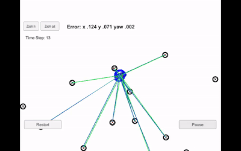
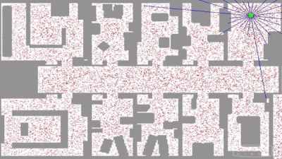

# The Kidnapped Vehicle

Self-Driving Car Engineer Nanodegree Program

---


## Introduction
In this project a two dimensional particle filter will be implemented in C++ capable of localizing a vehicle within desired accurancy and time. The particle filter will be given a map and some initial localization information (GPS). At each time step the filter will also get observation and control data. 

Below is a video from udacity of what it looks like when the simulator successfully is able to track the car to a particle. The simulator can display the best particle's sensed positions, along with the corresponding map ID associations. This can be extremely helpful when making sure transition and association calculations were done correctly.  The green laser sensors from the car nearly overlap the blue laser sensors from the particle, this means that the particle transition calculations were done correctly.

 

## Particle Filter
The particle filter technique provides a well-established methodology for generating samples from the required distribution without requiring assumptions about the state space or the state distributions. Particle filter implement the prediction updating transitions directly by using a genetic type of mutation-selection particle algorithm. The samples from the distribution are represented by a set of particles. Each particle has a likelihood weight assigned to it that represents he probability of that particle being sampled from the probability density function. 
The video below from the udacity is a great example of the technique of a particle filter by showing a global localization of a robot. The red dots represent the particles and the blue lines are the range measuremts of sonar sensors.

 

## Files and code

#### [/src/main.cpp:](https://github.com/JulePralle/SDC_Term2_Project3_KidnappedVehicle/blob/master/src/main.cpp)
* runs the particle filter
* measures the runtime and calculate the weighted error at each time step
* reads in the math, control and observation data for each time step
 
#### [/src/particle_filter.cpp:](https://github.com/JulePralle/SDC_Term2_Project3_KidnappedVehicle/blob/master/src/particle_filter.cpp)
* contains all of the implementations of the following functions of the particle filter class:
    1. init function:
    * initialize all aprticles to first position and all weights to 1
    * takes as input a GPS position (x,y) and initial heading estimate (theta) and an array of uncertainties (std)
    * samples from a Gaussian distribution centered around these measurements to initialize all the particles
    * initialize all particle weights to 1
    
    2. prediction function:
    * takes as input the amount of time between time steps, the velocity and yaw rate measurement uncertainties, current time step             velocity and yaw rate measurements
    * using the measurements, the function updates each particle's position estimates in account for sensor noise by adding Gaussian           noise
    
    3. dataAssociation function:
    * takes as input the vector of predicted landmark objects (prediction measurements between one particular particle and all of the         map landmarks within sensor range) and the vector of observation landmarks (actual landmark measurements gathered from LIDAR)
    * performs nearest neighbor data association
    * assigning each sensor observationto the map landmark ID associated with it
    
    4. updateWeights function:
    * takes as input the range of sensor, the landmark measurements uncertainties, a vector of landmark measurements and the map               landmarks
    * predicts measurements to all map landmarks within sensor range of each particle
    * calculates the new weight of each particle by using the multivariante Gaussian probability density function
    * normalize the weights
    
    5. resample function:
    * updates the particle to the Bayesian posterior distribution using the discrete distribution function
    


# Udacity Part
--- 

## Running the Code
This project involves the Term 2 Simulator which can be downloaded [here](https://github.com/udacity/self-driving-car-sim/releases)

This repository includes two files that can be used to set up and intall uWebSocketIO for either Linux or Mac systems. For windows you can use either Docker, VMware, or even Windows 10 Bash on Ubuntu to install uWebSocketIO.

Once the install for uWebSocketIO is complete, the main program can be built and ran by doing the following from the project top directory.

mkdir build
cd build
cmake ..
make
./particle_filter

Note that the programs that need to be written to accomplish the project are src/particle_filter.cpp, and particle_filter.h

The program main.cpp has already been filled out, but feel free to modify it.

Here is the main protcol that main.cpp uses for uWebSocketIO in communicating with the simulator.

INPUT: values provided by the simulator to the c++ program

// sense noisy position data from the simulator

["sense_x"] 

["sense_y"] 

["sense_theta"] 

// get the previous velocity and yaw rate to predict the particle's transitioned state

["previous_velocity"]

["previous_yawrate"]

// receive noisy observation data from the simulator, in a respective list of x/y values

["sense_observations_x"] 

["sense_observations_y"] 


OUTPUT: values provided by the c++ program to the simulator

// best particle values used for calculating the error evaluation

["best_particle_x"]

["best_particle_y"]

["best_particle_theta"] 

//Optional message data used for debugging particle's sensing and associations

// for respective (x,y) sensed positions ID label 

["best_particle_associations"]

// for respective (x,y) sensed positions

["best_particle_sense_x"] <= list of sensed x positions

["best_particle_sense_y"] <= list of sensed y positions


Your job is to build out the methods in `particle_filter.cpp` until the simulator output says:

```
Success! Your particle filter passed!
```

# Implementing the Particle Filter
The directory structure of this repository is as follows:

```
root
|   build.sh
|   clean.sh
|   CMakeLists.txt
|   README.md
|   run.sh
|
|___data
|   |   
|   |   map_data.txt
|   
|   
|___src
    |   helper_functions.h
    |   main.cpp
    |   map.h
    |   particle_filter.cpp
    |   particle_filter.h
```

The only file you should modify is `particle_filter.cpp` in the `src` directory. The file contains the scaffolding of a `ParticleFilter` class and some associated methods. Read through the code, the comments, and the header file `particle_filter.h` to get a sense for what this code is expected to do.

If you are interested, take a look at `src/main.cpp` as well. This file contains the code that will actually be running your particle filter and calling the associated methods.

## Inputs to the Particle Filter
You can find the inputs to the particle filter in the `data` directory. 

#### The Map*
`map_data.txt` includes the position of landmarks (in meters) on an arbitrary Cartesian coordinate system. Each row has three columns
1. x position
2. y position
3. landmark id

### All other data the simulator provides, such as observations and controls.

> * Map data provided by 3D Mapping Solutions GmbH.

## Success Criteria
If your particle filter passes the current grading code in the simulator (you can make sure you have the current version at any time by doing a `git pull`), then you should pass! 

The things the grading code is looking for are:


1. **Accuracy**: your particle filter should localize vehicle position and yaw to within the values specified in the parameters `max_translation_error` and `max_yaw_error` in `src/main.cpp`.

2. **Performance**: your particle filter should complete execution within the time of 100 seconds.


